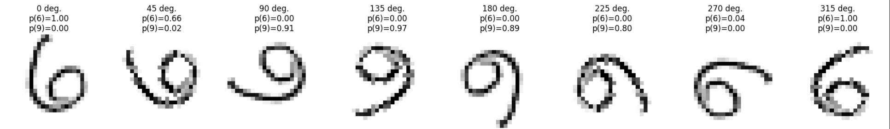
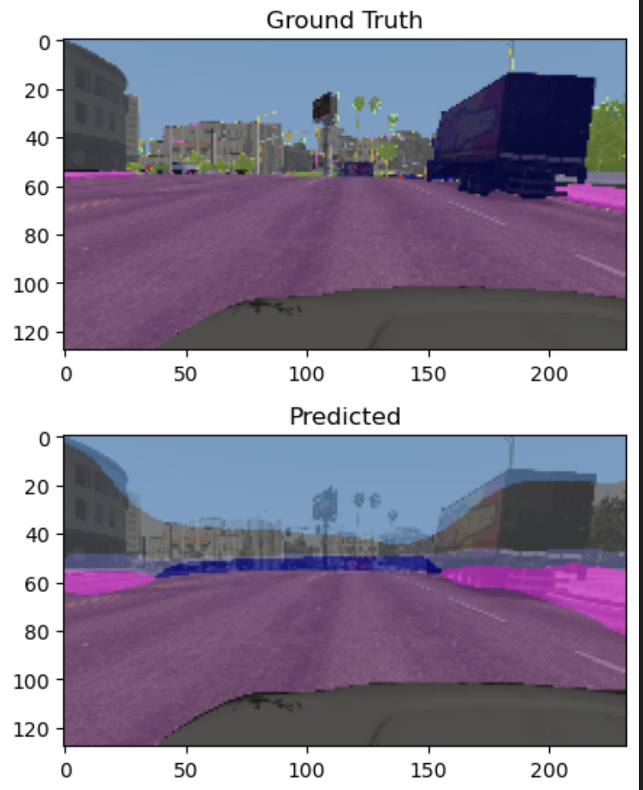
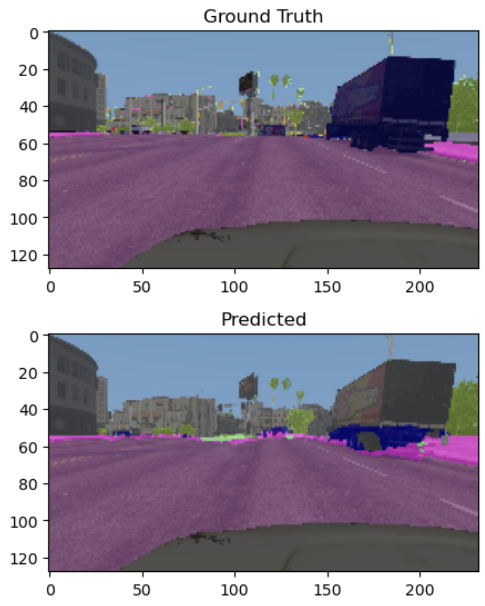
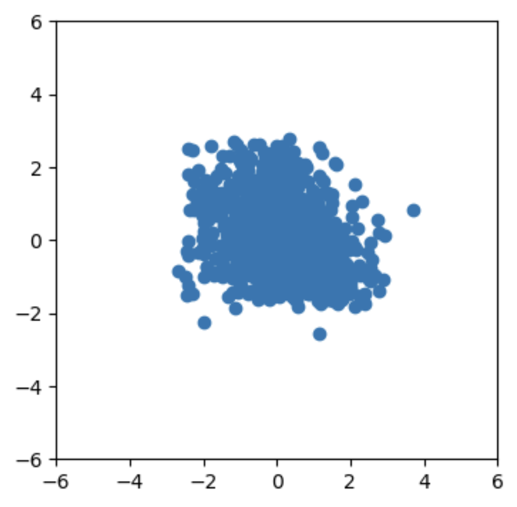
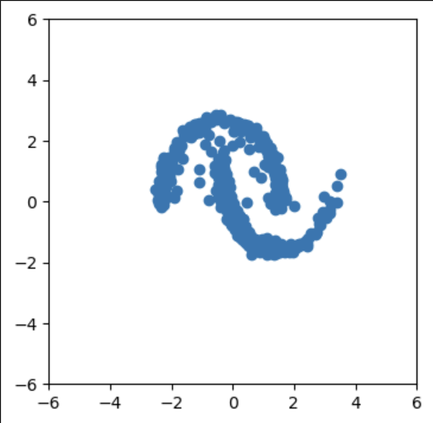
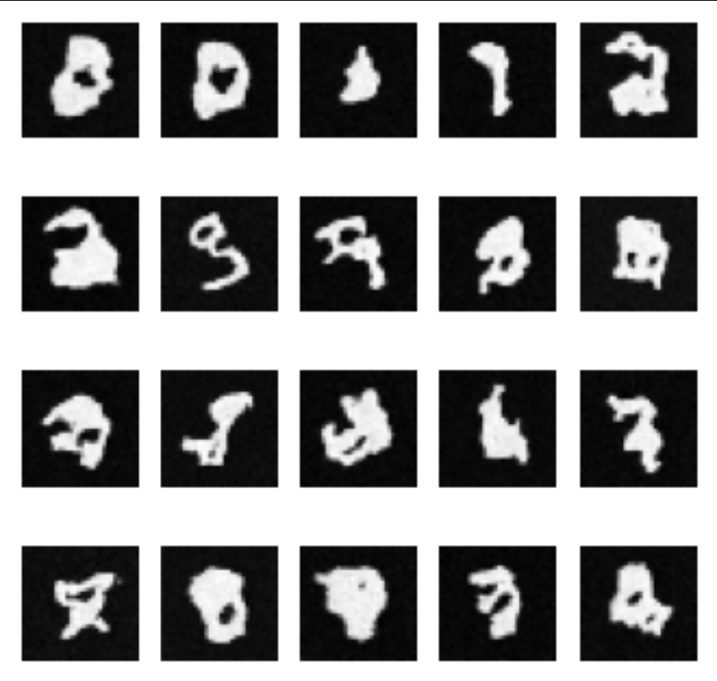
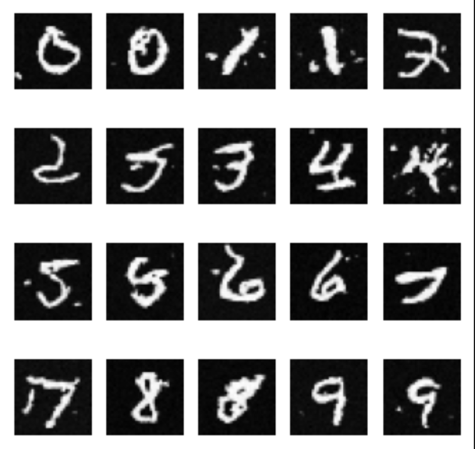

# TDDE70 Deep Learning Coursework

This repository contains solutions for the TDDE70 Deep Learning course (Linköping University, Spring 2024), including an intro notebook and four labs.

---

## Contents

- **Intro** – PyTorch basics: tensors, GPU, autograd, linear regression  
- **Lab 0:** PyTorch & NN fundamentals  
- **Lab 1:** Autoencoders & U‑Net  
- **Lab 2:** Denoising Diffusion Probabilistic Models (DDPM)  
- **Lab 3:** Graph Neural Networks (CGCNN)

---

## Intro: PyTorch Basics

Get started with:  
- Tensors & GPU support  
- Autograd & computational graphs  
- Building & training a linear regression model  

---

## Lab 0: PyTorch & Neural Network Fundamentals

- **Custom Modules**: Define `nn.Module` and fully‑connected layers  
- **Data Loading**: Convert MNIST to tensors, use `DataLoader`  
- **Simple CNN**: Conv layers with batch‑norm & dropout  
- **Training & Eval**: Optimizers, training loops, accuracy metrics  
- **Robustness**: Test on rotated MNIST digits  

  

---

## Lab 1: Autoencoders & U‑Net for Image‑to‑Image Tasks

- **Data Prep**: Custom `Dataset` for denoising & segmentation (GTAV)  
- **Model Design**: `DoubleConv`, `Down`, `Up`, `UpSkip` blocks; Autoencoder & U‑Net  
- **Training**: Denoising (MSE) & segmentation (weighted CE) with `Trainer` classes  
- **Enhancements**: Skip connections & EMA weight averaging 

  
  

---

## Lab 2: Diffusion Models

### Task 1: 2D Two‑Moon Generation  
- **Theory**: DDPM forward/backward processes, noise schedule  
- **Implementation**: MLP denoiser with positional embeddings & noise utilities  
- **Training & Sampling**: T=50 steps, L₂ loss, visualize samples  

  
  

### Task 2: Class‑Conditional MNIST Generation  
- **Architecture**: U‑Net with timestep & label embeddings, self‑attention  
- **cDDPM**: T=1000 diffusion steps on 32×32 MNIST  
- **Sampling**: Generate digits 0–9 conditioned on labels  

  
  

---

## Lab 3: Graph Neural Networks (CGCNN)

- **PyG Basics**: `Data` & `DataLoader` for graphs  
- **MPNN Equations**: Derive CGCNN’s message & update functions  
- **CGCNNLayer**: Gated message passing with BatchNorm  
- **Full Model**: Stack layers, global mean pooling, MLP head  
- **Training**: Compare invariant (distance) vs non‑invariant (vector) edge features  
